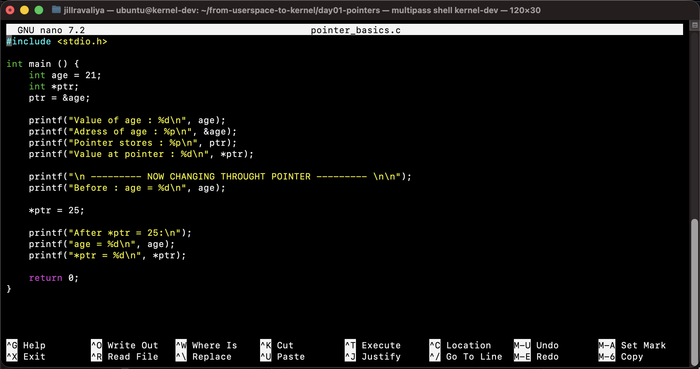
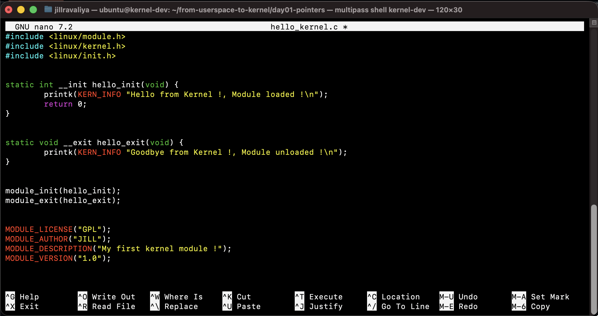
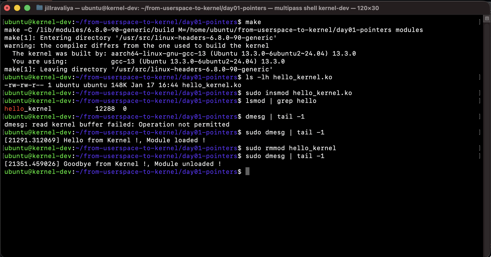

# Day 01: Foundations - Pointers to Kernel Space


This document chronicles the first day of my journey from userspace developer to kernel engineer. Starting with fundamental C pointer concepts and culminating in successfully loading custom code into the Linux kernel.

**Primary Achievement:** Built and loaded first kernel module (`hello_kernel.ko`) into running Linux kernel, demonstrating understanding of kernel space programming fundamentals.

---

## Part 1: Pointer Mastery

### Understanding Memory Addresses

**Core Concept Learned:** Pointers provide direct access to memory locations, enabling manipulation of data through addresses rather than variable names.

**The `&` Operator (Address-of):**
- Returns the memory address of a variable
- Example: `&age` gives the location where `age` is stored

**The `*` Operator (Dereference):**
- Accesses the value at a memory address
- Example: `*ptr` reads/writes the value at address stored in `ptr`

### Key Discovery: Direct Authority

> **Code Example:** `pointer_basics.c`



```c
int age = 21;
int *ptr;
ptr = &age;

printf("Value of age: %d\n", age);           // 21
printf("Address of age: %p\n", &age);         // 0xffffe4cdf53c
printf("Pointer stores: %p\n", ptr);          // 0xffffe4cdf53c (same!)
printf("Value at pointer: %d\n", *ptr);       // 21

*ptr = 25;  // Changes age without using 'age' variable name

printf("age = %d\n", age);    // Now 25!
printf("*ptr = %d\n", *ptr);  // Also 25!
```

**Insight:** Pointers grant "direct authority" to modify values through their memory addresses. This is fundamental to kernel programming where direct hardware access is required.

---

### Practical Application: Swap Function

> **Code Example:** `swap_pointers.c`

**Challenge:** Write a function that swaps two variables' values.

**Why Pointers Are Necessary:**
- C passes arguments by value (creates copies)
- Function working on copies doesn't affect original variables
- Pointers allow function to access original variable locations

---

**Solution:**
```c
void swap(int *a, int *b) {
    int temp = *a;  // Save value at address a
    *a = *b;        // Copy value from b to a
    *b = temp;      // Copy saved value to b
}

int main() {
    int x = 50, y = 100;
    
    printf("Before: x = %d, y = %d\n", x, y);
    swap(&x, &y);  // Pass addresses!
    printf("After: x = %d, y = %d\n", x, y);
    
    // Output:
    // Before: x = 50, y = 100
    // After: x = 100, y = 50
}
```


**Understanding:** By passing addresses (`&x`, `&y`), the function gains authority to modify the original variables.

---

## Part 2: Virtual Memory Architecture

### The Fundamental Question

**Why does virtual memory exist? Why not use physical RAM directly?**

This question led to understanding the entire memory management architecture.

### Physical vs Virtual Memory

**8GB Physical RAM:**
- Limited, real hardware
- Shared by all processes
- Fragmented over time

**Virtual Memory (per process):**
- Each process sees up to 128TB address space (64-bit)
- Isolated from other processes
- Appears continuous even if physical memory is fragmented

---

### The Page Table Translation

**Key Component:** Memory Management Unit (MMU) in CPU

**Process:**
1. Process accesses virtual address `0x1000`
2. MMU intercepts the access
3. MMU consults page table: `Virtual 0x1000 → Physical 0x5000`
4. MMU reads from physical address `0x5000`
5. Process never knows the real physical location

**Critical Insight:** Each process has its own page table, so the same virtual address maps to different physical locations for different processes.

---


### Benefits Discovered

**1. Process Isolation:**
- Process 1: Virtual `0x1000` → Physical `0x5000`
- Process 2: Virtual `0x1000` → Physical `0x9000`
- Same virtual address, different physical locations
- Processes cannot access each other's memory

**2. Security:**
- Invalid virtual address → Page fault → Process killed
- Kernel memory protected from userspace access
- MMU enforces boundaries in hardware

**3. Fragmentation Solution:**
- Process sees continuous 3GB virtual space
- Physical memory scattered in 4KB pages
- MMU handles the mapping complexity

**4. Memory Sharing:**
- Single physical copy of library (e.g., libc.so)
- Multiple processes map to same physical pages
- Significant memory savings

---


### Performance: The TLB Cache

**Problem:** Page table lookups require RAM access (100+ CPU cycles)

**Solution:** Translation Lookaside Buffer (TLB)
- Cache for recent virtual-to-physical translations
- Located in CPU (1-2 cycle access)
- 98%+ hit rate in practice
- Makes virtual memory nearly as fast as physical

**Result:** ~2% performance overhead for massive benefits in security and flexibility.

---

## Part 3: CPU Privilege Architecture

### Ring 0 vs Ring 3

**Ring 3 (Userspace):**
- Limited privileges
- Cannot access hardware directly
- Cannot modify kernel memory
- Safe sandbox for applications

**Ring 0 (Kernel Space):**
- Full hardware access
- Can modify any memory
- Can execute privileged CPU instructions
- Controls system resources

**Transition:** System calls cause CPU to switch from Ring 3 → Ring 0

---

### Real-World Example: Gaming at 144Hz

**Frame Time:** 1000ms ÷ 144 = 6.9ms per frame

**Per-Frame Requirements:**
- Network driver: Process packets (< 1ms)
- GPU driver: Render frame (< 4ms)
- Audio driver: Fill 10ms buffer (< 0.2ms)
- Scheduler: Manage processes (< 0.1ms)
- Game logic: Everything else (< 1.5ms)

**Total:** Must complete in 6.9ms or frame drops

**Why Drivers Run in Kernel:**
- Userspace driver: 2-5ms syscall overhead → Unplayable lag
- Kernel driver: Direct hardware access → < 0.5ms
- Interrupt handling: Only possible in Ring 0
- No virtual memory translation overhead

**Discovery:** The difference between 60fps and 144fps isn't just hardware—it's kernel optimization.

---

## Part 4: Kernel Modules Explained

### What Is a Kernel Module?

**The Kernel:** Core OS code running continuously in Ring 0 since boot

**The Problem:** 
- Adding features requires recompiling entire kernel
- Hours of compilation time
- System reboot required
- Risk of breaking entire system

**The Solution: Loadable Kernel Modules (LKM)**
- Separate compiled code (`.ko` files)
- Can be inserted into running kernel
- Can be removed without reboot
- If broken, unload without crashing system

**Analogy:** Like hot-plugging components into running engine

---

### Why Modules Are Necessary

**Real Example: USB Device**
1. Device plugged in
2. Kernel detects new hardware
3. Loads appropriate driver module
4. Device becomes usable
5. Unplug device → Module unloaded
6. Memory freed for other use

**Without modules:** Would need every possible driver compiled into kernel, wasting memory.

---

## Part 5: Building First Kernel Module

### Understanding Headers

**What `#include` Actually Does:**
- Not magic—literally copy-pastes file contents
- Preprocessor runs before compilation
- Brings in function declarations, macros, structures

**Why Kernel Headers Are Different:**

**Userspace (`stdio.h`):**
- Functions like `printf`, `scanf`
- Requires terminal, userspace libraries
- Not available in kernel

**Kernel (`linux/module.h`, `linux/kernel.h`):**
- Functions like `printk`, module macros
- Works in Ring 0 without userspace dependencies
- Located in `/lib/modules/$(uname -r)/build/include/`

---

### Header Breakdown

**`<linux/module.h>`:**
- `MODULE_LICENSE()`, `MODULE_AUTHOR()` macros
- `module_init()`, `module_exit()` registration
- Core module infrastructure

**`<linux/kernel.h>`:**
- `printk()` function (kernel's printf)
- `KERN_INFO`, `KERN_ERR` log levels
- Kernel utility functions

**`<linux/init.h>`:**
- `__init`, `__exit` memory optimization markers
- Tells kernel to free init code after module loads

---

### The Code: Line-by-Line Understanding

> **Complete Module:** `hello_kernel.c`



```c
#include <linux/module.h>
#include <linux/kernel.h>
#include <linux/init.h>

MODULE_LICENSE("GPL");
MODULE_AUTHOR("JILL");
MODULE_DESCRIPTION("My first kernel module !");
MODULE_VERSION("1.0");
```

**Metadata section:** Identifies module to kernel and users

---

```c
static int __init hello_init(void) {
    printk(KERN_INFO "Hello from Kernel !, Module loaded !\n");
    return 0;
}
```

**Breakdown:**
- `static`: Function private to this file (prevents symbol collision)
- `int`: Returns 0 for success, negative for error
- `__init`: Memory freed after first execution
- `printk(KERN_INFO ...)`: Writes to kernel log buffer
- `return 0`: Tells kernel initialization succeeded

---

```c
static void __exit hello_exit(void) {
    printk(KERN_INFO "Goodbye from Kernel !, Module unloaded !\n");
}
```

**Breakdown:**
- `void`: No return value (exit cannot fail)
- `__exit`: Kept in special memory section until unload

---

```c
module_init(hello_init);
module_exit(hello_exit);
```

**Registration macros:** Tell kernel which functions to call during load/unload

---

### Critical Concept: `static` Keyword

**Without `static`:**
```
Module 1: int init(void) { ... }
Module 2: int init(void) { ... }
// Both export 'init' to global kernel symbol table
// COLLISION! Kernel rejects second module
```

**With `static`:**
```
Module 1: static int init(void) { ... }  // Private to module1
Module 2: static int init(void) { ... }  // Private to module2
// No collision! Each module's symbols are private
```

---


### The Build System

**Understanding the Makefile:**
```makefile
obj-m += hello_kernel.o

all:
	make -C /lib/modules/$(uname -r)/build M=$(PWD) modules
```

**Breaking it down:**

**`obj-m += hello_kernel.o`**
- `obj-m`: Object file for module (not built into kernel)
- Tells kbuild system to create `.ko` from `.o`

**`make -C /lib/modules/$(uname -r)/build`**
- `-C`: Change directory to kernel build system
- `$(uname -r)`: Current kernel version (e.g., 5.15.0-56-generic)
- `/lib/modules/.../build`: Contains kernel's Makefile and headers

**`M=$(PWD)`**
- Tells kernel build system where module source code is located
- Build system compiles files in this directory

**`modules`**
- Target to build (creates `.ko` files)

**The Process:**
1. Change to kernel build directory
2. Kernel's Makefile reads our module directory
3. Finds `hello_kernel.c`
4. Compiles using kernel's build rules and headers
5. Creates `hello_kernel.ko` in our directory
6. Returns to original directory

**Why not regular `gcc`?**
- Kernel modules need special linking
- Must match exact kernel version
- Requires kernel-specific flags and configurations
- Uses kernel's build infrastructure

---


### File Extensions Explained

**`.c` (Source File):**
- Human-readable C code
- Cannot be executed

**`.o` (Object File):**
- Compiled machine code
- External symbols unresolved
- Not loadable into kernel

**`.ko` (Kernel Object):**
- Loadable kernel module
- Contains metadata section
- Symbols resolved or marked for resolution
- Ready for `insmod`

---

## Part 6: Security Deep Dive

### The Sudo Question

**Vulnerability Discovered:** If someone uses sudo once, 15-minute timeout allows anyone at keyboard to load modules without password.

**Attack Scenario:**
1. Friend uses `sudo apt update`
2. Password cached for 15 minutes
3. Friend leaves keyboard
4. Attacker runs `sudo insmod virus.ko`
5. Rootkit loaded without password!

### Defense Layers

**Layer 1: Sudo Timeout**
- High-security systems set `timestamp_timeout=0`
- Requires password for every sudo command
- Prevents cached credential attacks

**Layer 2: Module Signing (Primary Defense)**
```bash
# Attacker tries:
sudo insmod virus.ko

# Kernel checks:
- Is module signed with trusted key?
- NO!

# Result:
ERROR: Required key not available
Module verification failed
```

**How it works:**
- Modules must be signed with cryptographic key
- Only trusted keys accepted (vendor, distribution)
- Signature verification in kernel
- Cannot be bypassed without key

**Layer 3: Secure Boot**
- UEFI firmware verifies bootloader
- Bootloader verifies kernel
- Kernel verifies modules
- Chain of trust from hardware to software

**Layer 4: Kernel Lockdown**
- Prevents runtime kernel modification
- Blocks unsigned module loading
- Restricts `/dev/mem` access
- Even root cannot bypass

---

### Real-World Attack Vectors

**1. Physical Access Attack:**
- Requires: Multiple reboots, BIOS access
- Time needed: 30+ minutes
- Defense: Physical security, TPM, full disk encryption

**2. Supply Chain Attack:**
- Compromise vendor, steal signing keys
- Sign malicious drivers
- Distribute as legitimate updates
- Defense: Code review, multiple signatures, monitoring

**3. Social Engineering:**
- Trick user into running malicious script
- User enters sudo password
- Defense: User education, package verification

**Key Learning:** Security is layered. Breaking one layer doesn't compromise system.

---

## Part 7: Loading the Module

### Compilation

```bash
make
```



**Output:**
```
make -C /lib/modules/6.8.0-90-generic/build M=/home/ubuntu/from-userspace-to-kernel/day01-pointers modules
make[1]: Entering directory '/usr/src/linux-headers-6.8.0-90-generic'
warning: the compiler differs from the one used to build the kernel
  The kernel was built by: aarch64-linux-gnu-gcc-13 (Ubuntu 13.3.0-6ubuntu2~24.04) 13.3.0
  You are using:           gcc-13 (Ubuntu 13.3.0-6ubuntu2~24.04) 13.3.0
make[1]: Leaving directory '/usr/src/linux-headers-6.8.0-90-generic'
```


**Result:** `hello_kernel.ko` created (148K file size)

---

### Loading into Kernel

```bash
sudo insmod hello_kernel.ko
```

**What happens internally:**
1. CPU switches Ring 3 → Ring 0
2. Kernel validates module format
3. Checks signature (if enforced)
4. Resolves symbols (finds `printk` address)
5. Allocates kernel memory
6. Copies module code to kernel space
7. Calls `hello_init()` function
8. Module added to kernel's module list
9. Returns to Ring 3

---

### Verification

```bash
lsmod | grep hello
# Output: hello_kernel    12288  0

dmesg | tail -1
# Output: [21291.312069] Hello from Kernel !, Module loaded !
```

**Success:** Module running in kernel, message in kernel log!

---

### Unloading

```bash
sudo rmmod hello_kernel

dmesg | tail -1
# Output: [21351.459026] Goodbye from Kernel !, Module unloaded !
```

**Process:**
1. Check if module in use (reference count)
2. Call `hello_exit()` function
3. Remove from kernel module list
4. Free kernel memory
5. Module gone from system

---

## Key Concepts Mastered

### Memory & Pointers
- Direct memory address manipulation
- Pointer arithmetic for array traversal
- Function modification of caller variables
- Foundation for all kernel programming

### Virtual Memory
- Page table translation mechanism
- MMU hardware operation
- TLB caching for performance
- Process isolation and security

### Kernel Architecture
- Ring 0 vs Ring 3 privilege levels
- Why drivers need kernel space
- Real-time constraints and scheduling
- Hardware interrupt handling

### Module Development
- Header file inclusion mechanism
- Kernel vs userspace headers
- Module metadata and registration
- Memory optimization with `__init`/`__exit`

### Build System
- Kernel module compilation process
- Makefile variables and targets
- Symbol resolution and linking
- `.c` → `.o` → `.ko` pipeline

### Security
- Module signing and verification
- Secure Boot chain of trust
- Kernel lockdown modes
- Multi-layered defense strategy

---

## Next Steps (Day 2)

- Kernel modules with parameters
- Reading/writing `/proc` filesystem
- Introduction to character devices
- Understanding file operations structure

---

## Reflections

Started the day understanding basic C syntax. Ended by loading custom code into the Linux kernel.

The journey from userspace thinking to kernel thinking required understanding:
- How memory actually works (not just variable names)
- How processes are isolated (page tables, MMU)
- How hardware is accessed (Ring 0, direct addressing)
- How security is enforced (cryptographic signing, multiple layers)

---

Every concept connects to the others. Pointers enable direct hardware access. Virtual memory enables process isolation. CPU rings enforce security. Module signing prevents unauthorized kernel code.

This is systems programming. This is how computers actually work.


> **Most Important Learning:** Kernel programming isn't about memorizing APIs—it's about understanding how hardware, CPU, and memory interact at the lowest level.
